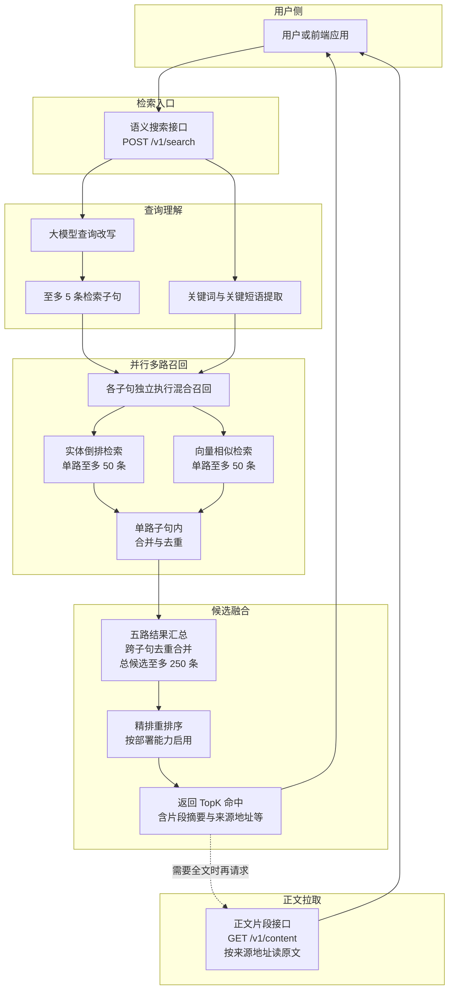
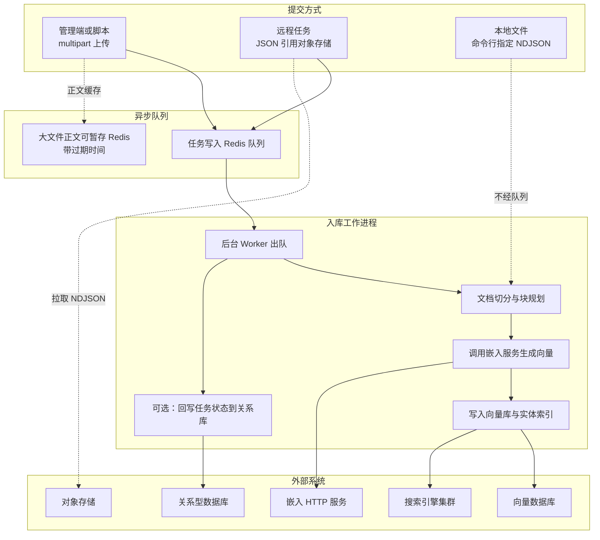

# ai-search-v1

面向 Agent 的语义搜索 MVP：Go 单体服务（检索、入库编排）+ 可选 Redis 异步入库队列 + 可选自建 Python 嵌入 HTTP 服务 + Vite/React 管理端与搜索页。

系统设计与数据流见根目录 **[design.md](./design.md)**（配套 [design-architecture.md](./design-architecture.md)、[design-tasks.md](./design-tasks.md)）。

更完整的组件图与查询时序见 **[design-architecture.md](./design-architecture.md)** §2–§3。流程图为**中文业务视角**（不贴类型名）；与代码、常量的对应关系见各图下说明。需支持 Mermaid 的预览器方可渲染。

### 检索流程（中文）



- **查询理解**：大模型改写得到多路子句；**关键词提取**从原始问句得到术语 / 短语线索，供实体倒排等召回使用（与改写并行进入混合召回）。Go 侧轻量实现见 [`internal/query/entity`](internal/query/entity)；可选 KeyBERT 类服务见 [`model_services/embedding-service`](./model_services/embedding-service/README.md) 的 `POST /v1/keywords`。
- 子句条数上限 **5**、单路召回上限 **50**、合并池上限 **250**：实现见 [`internal/query/recall/parallel.go`](internal/query/recall/parallel.go)。每路子句内「实体 + 向量」的混合与合并见 [`internal/query/recall/orchestrator.go`](internal/query/recall/orchestrator.go)。
- **精排**：仓库内已预留 rerank 相关包；是否接入以部署与 [`design.md`](./design.md) 为准，未接入时仍按召回侧分数输出。
- **正文接口**：实现见 [`internal/api/handler/content.go`](internal/api/handler/content.go)。

### 入库流程（中文）



- 异步路径对应 Admin **`POST /v1/admin/ingest`** / **`POST /v1/admin/ingest/remote`** 与 **`cmd/importer`** 消费队列；本地路径对应 **`cmd/importer -input`**。实现入口见 [`internal/app/http.go`](internal/app/http.go)、[`internal/ingest/pipeline/runner.go`](internal/ingest/pipeline/runner.go)。

---

## 环境要求

- **Go**：版本以根目录 **`go.mod`** 为准（当前为 Go 1.25+）。
- **Node.js**：用于前端 `web/heroic-web3-gateway`（建议 18+）。
- **Redis**（可选）：启用 Admin 异步入库 `POST /v1/admin/ingest*` 时必需。
- **Milvus / Elasticsearch / MySQL** 等：按 `configs/api.yaml` 与 `.env` 实际部署情况连接。

依赖安装：

```bash
go mod download
```

密钥与覆盖项放在仓库根目录 **`.env`**（勿提交 git），模板见 **`.env.example`**。`cmd/api` 与 `cmd/importer` 启动时会自当前工作目录向上查找含 `go.mod` 的模块根，再加载 **模块根** 下的 `configs/.env`（若存在）与 **`.env`**。

---

## 一、后端 API（`cmd/api`）

在项目根目录（含 `configs/`）执行：

```bash
go run ./cmd/api
```

或编译后运行：

```bash
go build -o api ./cmd/api
./api
```

Windows PowerShell：

```powershell
go build -o api.exe ./cmd/api
.\api.exe
```

常用环境变量：

| 变量 | 说明 |
|------|------|
| `HTTP_ADDR` | 监听地址，覆盖 `configs/api.yaml` 中 `http.addr`（如 `0.0.0.0:8080`） |
| `MILVUS_PASSWORD`、`ES_*` 等 | 见 `.env.example` |

主要 HTTP 路由（实现见 `internal/app/http.go`）：

- `GET /healthz` — 健康检查
- `POST /v1/search` — 语义搜索
- 在 **Redis 入库队列已启用** 时注册：`POST /v1/admin/ingest`（multipart）、`POST /v1/admin/ingest/remote`（JSON + S3 引用），返回 **202** 与 `job_id`

---

## 二、入库队列（Redis）与 Worker（`cmd/importer`）

### 2.1 流程简述

1. 客户端调用 Admin 接口 → 任务入 **Redis List**（multipart 正文或远程任务元数据带 TTL）。
2. **`cmd/importer` 不带 `-input`** 时以 **Worker** 身份常驻消费，调用 `internal/ingest/pipeline` 的 **Runner**，按配置写入 **Milvus** 与 **ES**（未启用 Hnsw索引优化经 **S3 GetObject** 流式读 NDJSON。
3. 嵌入一律通过 **OpenAI 兼容 HTTP**（见下文「嵌入服务」）。

### 2.2 环境变量（根目录 `.env`）

至少配置其一连接 Redis，并打开开关：

- `REDIS_INGEST_URL=redis://...` **或** `REDIS_INGEST_HOST` + `REDIS_INGEST_PORT`（等，见 `.env.example`）
- `REDIS_INGEST_ENABLED=true`

可选：`REDIS_INGEST_LIST_KEY`、`REDIS_INGEST_PAYLOAD_TTL_SEC`、`REDIS_INGEST_JOB_META_TTL_SEC`、`REDIS_INGEST_WORKER_CONCURRENCY`；S3 远程入库用 `S3_ENDPOINT`、`AWS_*` 等。

Worker 侧：`IMPORTER_HTTP_ADDR` 默认可选 HTTP（默认 `:18080`，空字符串则关闭），路径 `GET /health`、`GET /`；默认**不**持 Redis 单例锁，可多进程并行消费同一队列；若需同队列仅单进程：`IMPORTER_REQUIRE_SINGLETON_LOCK=true` 或 `-require-singleton-lock`。`-workers` / `REDIS_INGEST_WORKER_CONCURRENCY` 大于 1 时，本进程内多个 `ProcessJob` 可并行执行。

### 2.3 启动 Worker

在项目根目录：

```bash
go run ./cmd/importer -config configs/api.yaml
```

（**不要**传 `-input`，即进入队列消费模式；需 Redis 已配置且 `REDIS_INGEST_ENABLED=true`。）

并发协程：`-workers N` 或环境变量 `REDIS_INGEST_WORKER_CONCURRENCY`（上限见代码注释）。多协程/多进程会并行执行 `ProcessJob`，请自行评估 Milvus/ES 压力与幂等（如 `upsert`）。

### 2.4 单次本地文件导入（不经过队列）

适用于离线 NDJSON（扩展名 `.ndjson` / `.jsonl` / `.json` 等，与 `design.md` 一致）：

```bash
go run ./cmd/importer -config configs/api.yaml -input test.ndjson
```

干跑（不写入）：

```bash
go run ./cmd/importer -config configs/api.yaml -input test.ndjson -dry-run
```

**说明**：当前实现下，NDJSON 与 `.txt`/`.md` 整篇在入库前均会按 `configs/api.yaml` 中 **`ingest.chunk_size` / `ingest.chunk_overlap`** 递归切分后再嵌入（无「关闭二次切分」开关）。可用 `-chunk-size`、`-chunk-overlap` 覆盖 yaml。

其它常用参数：`-partition`、`-upsert`（**默认 true**，Milvus Upsert；需 Insert 时传 `-upsert=false`）、`-no-flush`、`-ensure-collection=false`。

---

## 三、嵌入服务（HTTP）

Go 进程内 **仅**通过 **OpenAI 风格 `POST /v1/embeddings`** 获取向量；来源由根目录 `.env` 的 **`EMBEDDING_SOURCE`** 切换（详见 `design.md` §6.3 与 `internal/config/embedding.go`）。

| 模式 | 要点 |
|------|------|
| **`remote`**（或 `api` / `cloud`） | `EMBEDDING_API_BASE_URL` + `/v1/embeddings`（未设 base 时用 `configs/api.yaml` 的 `embedding.endpoint`）；鉴权 **`EMBEDDING_API_KEY`** |
| **`self_hosted`**（或 `local_service` / `python`） | 客户端拼 `http://EMBEDDING_LOCAL_HTTP_HOST:EMBEDDING_LOCAL_HTTP_PORT/v1/embeddings`；鉴权 **`EMBEDDING_LOCAL_API_KEY`**（与远程 Key 分离） |

`configs/api.yaml` 中 **`embedding.backend` 仅支持 `http`**；`embedding.expected_dim` 须与 Milvus `vector_dim` 及模型输出维度一致。

### 自建 Python 服务（`model_services/embedding-service`）

安装与启动详见 **[model_services/embedding-service/README.md](./model_services/embedding-service/README.md)**。常用启动命令：

```bash
cd model_services/embedding-service
python -m venv .venv
# Windows: .venv\Scripts\activate
pip install -r requirements.txt
uvicorn app:app --host 0.0.0.0 --port 3888
```

联调时在仓库根 `.env` 设 `EMBEDDING_SOURCE=self_hosted`，`EMBEDDING_LOCAL_HTTP_HOST=127.0.0.1`、`EMBEDDING_LOCAL_HTTP_PORT=3888`，且 **`EMBEDDING_MODEL`** 在 Go 请求体与 Python 加载侧保持一致。

根目录 **`demo_call_local.py`** 可按 `EMBEDDING_SOURCE` 对远程或本地嵌入 URL 做冒烟调用。

---

## 四、前端（`web/heroic-web3-gateway`）

技术栈：Vite + React + TypeScript；开发服务器默认 **端口 8008**，并将 **`/v1` 代理到 `http://127.0.0.1:8080`**（见 `vite.config.ts`）。

```bash
cd web/heroic-web3-gateway
cp .env.example .env   # 首次按需复制
npm install
npm run dev
```

浏览器访问开发地址（一般为 `http://localhost:8008` 或终端打印的 URL）。

生产构建：

```bash
npm run build
npm run preview   # 本地预览 dist
```

### 4.1 前端环境变量（`web/heroic-web3-gateway/.env`）

模板：**`web/heroic-web3-gateway/.env.example`**。

| 变量 | 作用 |
|------|------|
| **`VITE_USE_MOCK_API`** | 未设置时默认为 **true**。为 `false` 时，Admin 的 Query/Upload 与 Search 页的 `searchStream` / `searchApi` 走真实后端 **`/v1`**；为 `true` 时使用本地 Mock。 |
| **`VITE_API_BASE_URL`** | 可选，完整 API 根 URL（**不要**末尾斜杠）。留空时请求使用相对路径 **`/v1`**，由 Vite 开发代理转发到本机 Go（默认 8080）。 |

### 4.2 前端路由与主要源码路径

| 路径 | 说明 |
|------|------|
| **`/`** | 入口页（`src/pages/Index.tsx`） |
| **`/search`** | 搜索页（`src/pages/Search.tsx`） |
| **`/admin`** | 管理端：入库上传、任务查询等（`src/pages/Admin.tsx`） |

| 源码路径 | 说明 |
|----------|------|
| `src/App.tsx` | 路由注册 |
| `src/lib/env.ts` | `VITE_USE_MOCK_API` 解析；导出 `useMockQueryAndUpload`、`useMockPublicSearch` |
| `src/lib/adminIngestApi.ts` | Admin 入库 `POST /v1/admin/ingest`、任务查询等与后端 DTO 对齐的封装 |
| `src/lib/adminQueryApi.ts` | Admin 侧 Query 等接口封装 |
| `src/lib/searchApi.ts` / `searchTypes.ts` | 真实搜索 API 类型与调用 |
| `src/lib/mockSearchApi.ts`、`mockMilvusApi.ts` | Mock 搜索与 Milvus 相关接口 |
| `src/index.css` | 全局样式 |

侧边栏行为（与设计 §15.3 一致）：Search 页可进入 Knowledge（`/admin`）、API 文档链接基于 `VITE_API_BASE_URL` 推导 `/v1` 等。

---

## 五、配置文件说明

| 文件 | 作用 |
|------|------|
| **`configs/api.yaml`** | 主配置：HTTP 端口、Milvus、Elasticsearch、`ingest.chunk_*`、嵌入 HTTP（endpoint、model、`expected_dim` 等）。环境变量可覆盖部分项（见文件内注释）。 |
| **`configs/importer.yaml`** | 导入说明与运行示例注释；实际运行时与 API 共用 **`configs/api.yaml`**（`cmd/importer` 可用 `-config` 指定其它 yaml）。 |
| **根目录 `.env`** | 密钥与运行覆盖：`EMBEDDING_*`、`REDIS_INGEST_*`、`MYSQL_DSN`、`AWS_*`、`REWRITE_*` 等；完整列表见 **`.env.example`**。 |
| **`migrations/001_ingest_job.sql`** | 入库 Job 元数据表；使用 `MYSQL_DSN` 等功能前按需执行。 |

---

## 六、项目目录结构（概要）

```text
仓库根/
  cmd/
    api/              # HTTP API 服务入口
    importer/         # 无 -input：Redis 队列 Worker；有 -input：单次 NDJSON 导入
    cleaner/          # 清理相关工具
    evaluator/        # 评测、milvuspeek 等
  internal/
    app/              # HTTP 组装、路由挂载
    api/              # handler、dto、middleware
    queue/            # Redis 入库 broker、可选 importer 单例锁
    query/            # rewrite、entity、recall、rerank、pipeline
    ingest/           # 解析、切分、管线、元数据（meta）
    storage/          # es、milvus、meta、s3、mysqldb
    model/            # embedding、rewrite、rerank 等客户端
    config/           # yaml 与环境变量加载
    observability/    # 可观测性
    eval/、clean/     # 评测与清理子域
  pkg/                # 可复用类型与工具
  configs/            # api.yaml 等
  migrations/         # SQL 迁移
  model_services/
    embedding-service/# 可选：OpenAI 兼容嵌入 HTTP 服务
  web/
    heroic-web3-gateway/  # Vite/React 前端
  plan/               # 设计计划文档（*.plan.md）
  scripts/            # 辅助脚本（如 Milvus/ES 运维脚本）
  design.md           # 主设计文档
  demo_call_local.py  # 嵌入 HTTP 冒烟脚本
```

---

## 七、其它工具（可视化与客户端）

### Attu（Milvus）

[Attu](https://github.com/zilliztech/attu) 为 Zilliz 开源的 **Milvus Web 管理界面**：连接本机或集群中的 Milvus 后，可浏览 Collection、分区、索引与样例数据，便于对照 `configs/api.yaml` 里的地址与凭据做联调与排障。常见用法为 Docker 或独立安装包启动后，在浏览器中配置 Milvus gRPC/HTTP 端点。

### Elasticsearch 客户端插件（如 VS Code「ES Client」类扩展）

在 **VS Code** 扩展市场可安装名称里带 **Elasticsearch** / **ES Client** 的插件（不同作者功能略有差异），用于 **配置集群地址与鉴权**、执行 **DSL / 查询**、查看 **索引 mapping 与文档**，便于核对实体倒排索引是否与入库字段一致。使用前需在插件中填写与 `configs/api.yaml`、`.env` 中一致的 ES 地址（及若开启时的账号密码）。

---

## 八、文档索引

- **架构与接口、队列、嵌入**：**[design.md](./design.md)**
- **Python 嵌入服务细节**：[model_services/embedding-service/README.md](./model_services/embedding-service/README.md)、[model_services/embedding-service/DESIGN.md](./model_services/embedding-service/DESIGN.md)
