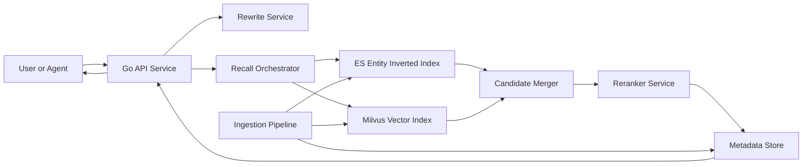
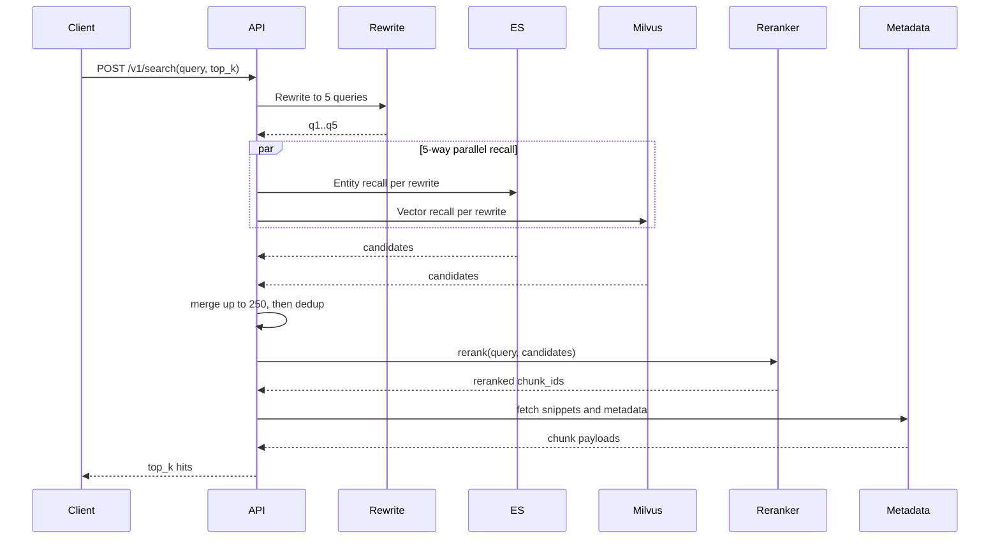

# 语义搜索系统设计（架构图版）

## 1. 目标

- 面向 Agent 查询，返回最相关 `top_k` 段落证据。
- MVP 路线：`5路 query 重写 + 实体倒排 + 向量召回 + 外部 reranker`。
- 支持网页与 PDF，两类来源统一到 `chunk_id`。

## 2. 组件架构图

## 3. 查询时序图

## 4. 核心数据模型

### 4.1 主键
| 字段名 | 类型 | 含义 | 外键/同值关系说明 |
| --- | --- | --- | --- |
| `doc_id` | `string` | 文档主键（URL 规范化哈希 / PDF 文档 ID） | 在 Metadata 表中作为文档级关联键；一个 `doc_id` 对应多个 `chunk_id` |
| `chunk_id` | `string` | 全局唯一 chunk 标识（由 `doc_id + page_no + chunk_no` 稳定哈希生成） | ES、Milvus、Metadata 三处同值；作为跨系统 join 键 |

### 4.2 ES 索引：`entity_postings_v1`
| 字段名 | 类型 | 含义 | 外键/同值关系说明 |
| --- | --- | --- | --- |
| `entity_key` | `keyword` | 归一化后的实体/术语键，用于倒排检索入口 | 无外键；通过该键查到候选 `chunk_id` |
| `chunk_id` | `keyword` | 被该实体命中的 chunk 标识 | 与 Milvus `chunk_id`、Metadata `chunk_id` 同值 |
| `doc_id` | `keyword` | chunk 所属文档标识 | 与 Metadata `doc_id` 同值 |
| `source_type` | `keyword` | 数据来源类型（`web`/`pdf`） | 与 Metadata `source_type` 同值 |
| `lang` | `keyword` | 语言标识（如 `zh`、`en`） | 与 Metadata `lang` 同值 |
| `ts` | `date` | 索引写入/更新时间 | 可与 Metadata `ingest_time` 对齐校验 |

### 4.3 Milvus 集合：`chunk_vectors_v1`
| 字段名 | 类型 | 含义 | 外键/同值关系说明 |
| --- | --- | --- | --- |
| `chunk_id` | `string` (primary key) | 向量记录主键 | 与 ES `chunk_id`、Metadata `chunk_id` 同值 |
| `embedding` | `vector<float>` | chunk 的语义向量 | 无外键；用于向量相似度检索 |
| `source_type` | `string` (scalar) | 来源类型过滤字段（`web`/`pdf`） | 与 Metadata `source_type` 同值 |
| `lang` | `string` (scalar) | 语言过滤字段 | 与 Metadata `lang` 同值 |
| `ts` | `int64`/`timestamp` (scalar) | 向量写入时间或版本时间戳 | 可与 ES `ts`、Metadata `ingest_time` 做一致性对齐 |

### 4.4 Metadata 表：`chunk_metadata`
| 字段名 | 类型 | 含义 | 外键/同值关系说明 |
| --- | --- | --- | --- |
| `chunk_id` | `string` (PK) | chunk 级主键 | 与 ES/Milvus 的 `chunk_id` 同值（跨系统主关联键） |
| `doc_id` | `string` | 文档主键 | 与 ES `doc_id` 同值 |
| `source_type` | `string` | 来源类型（`web`/`pdf`） | 与 ES/Milvus `source_type` 同值 |
| `title` | `string` | 文档或页面标题 | 无外键 |
| `url` | `string` (nullable) | 网页来源地址 | `source_type=web` 时有值 |
| `pdf_page` | `int` (nullable) | PDF 页码 | `source_type=pdf` 时有值 |
| `chunk_text` | `text` | 返回与重排使用的原始段落文本 | 无外键 |
| `token_count` | `int` | chunk token 数，用于分块与成本控制 | 无外键 |
| `lang` | `string` | 语言标识 | 与 ES/Milvus `lang` 同值 |
| `ingest_time` | `timestamp` | 导入入库时间 | 可与 ES `ts`、Milvus `ts` 对齐校验 |

## 5. API 契约（MVP）

接口：`POST /v1/search`

请求：
- `query` string
- `top_k` int (default: 10)
- `request_id` string

响应：
- `hits[]` 字段定义：

| 字段名 | 类型 | 含义 | 数据语义说明 |
| --- | --- | --- | --- |
| `chunk_id` | `string` | 命中结果的唯一片段 ID | 片段级标识（不是整文） |
| `snippet` | `string` | 返回给上游 Agent 的可读文本 | 文档原始文本片段（chunk） |
| `score` | `float` | 最终排序分数（来自 reranker） | 排序信号，不是向量 |
| `source_type` | `string` | 来源类型（`web`/`pdf`） | 结果来源元信息 |
| `url_or_doc_id` | `string` | 网页 URL 或 PDF 文档 ID | 文档级定位信息（不是全文内容） |
| `pdf_page` | `int` (nullable) | PDF 页码 | 文档内定位信息；web 场景为空 |
| `title` | `string` | 文档标题或页面标题 | 文档级元信息 |

- `debug`（optional）字段定义：

| 字段名 | 类型 | 含义 | 数据语义说明 |
| --- | --- | --- | --- |
| `rewrites` | `string[]` | 5 路 query 重写文本 | 查询侧中间结果，不是文档内容 |
| `recall_counts` | `object` | 各召回阶段命中数量统计 | 诊断信息，不是检索结果内容 |
| `merged_count` | `int` | 进入 rerank 前的候选规模 | 诊断信息，不是文档内容 |

## 6. 模型选型（MVP 固定）

- Embedding：`Qwen3-Embedding-0.6B`
- Reranker：`Qwen3-Reranker-0.6B`

约束：同一轮离线评测和线上 A/B 不混用其他 embedding / reranker 模型。

## 7. SLO 与降级

- 查询链路目标：`P95 <= 800ms`
- 总超时预算控制，允许慢路跳过
- rewrite 失败降级到原 query 单路召回 + rerank
