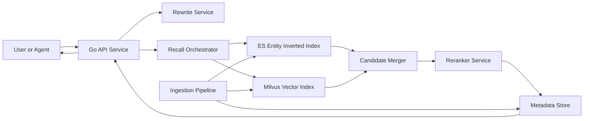
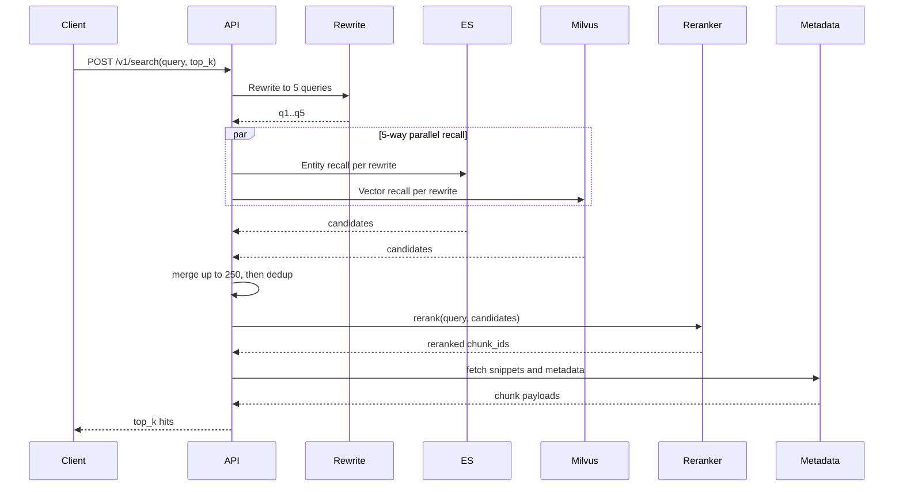

# 语义搜索系统设计（架构图版）

## 1. 目标

- 面向 Agent 查询，返回最相关 `top_k` 段落证据。
- MVP 路线：`5路 query 重写 + 实体倒排 + 向量召回 + 外部 reranker`。
- 支持网页与 PDF，两类来源统一到 `chunk_id`。

## 2. 组件架构图

## 3. 查询时序图

## 4. 核心数据模型

### 4.1 主键
- `doc_id`: 文档主键（URL 规范化哈希 / PDF 文档 ID）
- `chunk_id`: 全局唯一（`doc_id + page_no + chunk_no` 稳定哈希）

### 4.2 ES 索引：`entity_postings_v1`
- `entity_key` (keyword)
- `chunk_id` (keyword)
- `doc_id` (keyword)
- `source_type` (keyword)
- `lang` (keyword)
- `ts` (date)

### 4.3 Milvus 集合：`chunk_vectors_v1`
- `chunk_id` (primary key)
- `embedding` (vector<float>)
- `source_type` (scalar)
- `lang` (scalar)
- `ts` (scalar)

### 4.4 Metadata 表：`chunk_metadata`
- `chunk_id` (PK)
- `doc_id`
- `source_type`
- `title`
- `url`
- `pdf_page`
- `chunk_text`
- `token_count`
- `lang`
- `ingest_time`

## 5. API 契约（MVP）

接口：`POST /v1/search`

请求：
- `query` string
- `top_k` int (default: 10)
- `source_types` array (`web|pdf`)
- `filters` object
- `request_id` string

响应：
- `hits[]`: `chunk_id`, `snippet`, `score`, `source_type`, `url_or_doc_id`, `pdf_page`, `title`
- `debug` (optional): rewrites, recall_counts, merged_count

## 6. 模型选型（MVP 固定）

- Embedding：`Qwen3-Embedding-0.6B`
- Reranker：`Qwen3-Reranker-0.6B`

约束：同一轮离线评测和线上 A/B 不混用其他 embedding / reranker 模型。

## 7. SLO 与降级

- 查询链路目标：`P95 <= 800ms`
- 总超时预算控制，允许慢路跳过
- rewrite 失败降级到原 query 单路召回 + rerank
