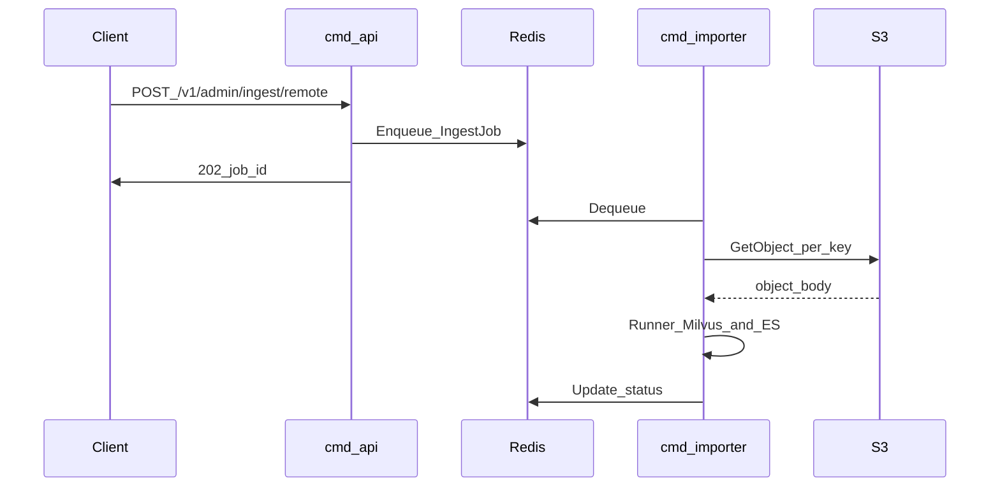

# Embedding 服务、入库队列、ES 倒排与存储结构扩展

## 现状摘要（与 [design.md](../design.md) 对齐）

- 主文档 [§4.2–4.3](../design.md) 定义 ES 实体倒排与 Milvus 向量集合；实现上 ES 已采用「每 `chunk_id` 一条文档 + `entity_keys` 数组」方案（与文档里「每 entity 一条 posting」的叙述略有差异，以代码为准：[internal/storage/es/repository.go](../internal/storage/es/repository.go)）。
- 入库（当前实现）：在 **REDIS_INGEST_ENABLED=true** 且配置 **REDIS_INGEST_URL** 时，`POST /v1/admin/ingest` 与 `POST /v1/admin/ingest/remote` 均 **先入 Redis 队列** 并返回 **202** + `job_id`；multipart 正文存 Redis（TTL **3h**）；远程 Job 相关 Redis 键 **TTL 24h**；**`cmd/importer` Worker**（无 `-input`）消费队列并调用 [Runner](../internal/ingest/pipeline/runner.go) **同时写 Milvus + ES**。`cmd/importer -input <file>` 仍为单次本地 NDJSON 同步导入。配置见根目录 [.env.example](../.env.example)。
- ES 召回：[SearchByEntityKeys](../internal/storage/es/repository.go) 使用 `bool` + `should` 多 `term` 与排序链（`_score`、`update_time`、`chunk_id`）；与 design §4.2 一致；尚未与「多路 rewrite + 合并」强绑定（后续可在 query pipeline 层组合）。

---

## 1. Python + HuggingFace 本地 Embedding 服务（先写设计文档）

**动机**：Go 侧通过 HTTP 调嵌入已是事实（[internal/model/embedding/http_embedder.go](../internal/model/embedding/http_embedder.go)）；本地用 HuggingFace 跑 **Qwen3-Embedding-0.6B**（见 design §14）放在独立 Python 服务中最稳妥。

**建议新增文档**（仅设计、本期可不写实现代码）：例如仓库下 `python/embedding-service/DESIGN.md`（或 `services/hf-embedding/DESIGN.md`），应包含：

- **目标与边界**：仅提供与现有 Go `http` embedder 兼容的 REST 契约；单机部署；不负责鉴权（或可选 API Key）。
- **API 契约**：与现有配置对齐：`POST` 批量文本 → 返回 float 向量列表；维度与 `configs/api.yaml` 中 `embedding`/`milvus.vector_dim` 一致；超时与最大 batch 建议值。
- **模型加载**：`transformers` / `sentence-transformers` 择一；模型名与缓存目录；GPU/CPU、dtype。
- **运行形态**：`uv`/`pip` + `fastapi` + `uvicorn`；健康检查 `/healthz`。
- **与 Go 对接**：嵌入服务地址等 **优先用 `.env`**（与现有工程 [internal/config/dotenv.go](../internal/config/dotenv.go) 一致）；[.env.example](../.env.example) 增补变量名（实现阶段再做）。
- **非目标**：不实现 reranker；不替代云端 API 路径。

**不在本期设计文档中强行规定**具体 Python 依赖版本号，但应写明「与 Qwen3-Embedding-0.6B 官方要求一致」。

---

## 2. Go 入库 Job 队列（**Redis + S3**；心智上可参考 Huey）

**可对齐的概念**：**Redis** 存任务消息，以及 **multipart 测试路径下的文件正文**；**Consumer** 为 `cmd/importer` Worker。

**写入目标**：Worker 调用现有 [Runner](../internal/ingest/pipeline/runner.go)（Embedder + Milvus + 可选 ES），**Milvus 与 ES 与现网一致同时写入**（ES 未启用则跳过，同当前 Runner）。

**远程（S3）**：**POST /v1/admin/ingest/remote** 只入队 **S3 引用**，API 不读 S3。Worker 按 **S3 对象逐个** `GetObject`，再 `Runner.RunNDJSON`；单对象内 NDJSON **按行解析**。

**本地（multipart）**：**POST /v1/admin/ingest** 将 **上传文件正文 `SETEX` 到 Redis**（**TTL 3 小时**），队列入队消息只带 `payload_redis_key`（等）与元数据；Worker `GET` 后跑 `Runner`。用于测试与小文件。

本地上传并列流程：**API → Redis 存正文（3h）→ 入队 → Worker GET 正文 → Runner（Milvus+ES）**。

### 2.1 Job 类型、载荷与 Redis TTL

**公共字段**：`job_id`；**payload_kind**（如 `multipart_redis` | `s3`，与表单 `source_type` web/pdf 区分）；管道参数（`partition`、`upsert`、`chunk_expand`、`source_type`、`lang`、`doc_id`、`page_no` 等）；可选 `task_id`。

**类型 A — multipart**：每个文件 **正文存 Redis**（建议独立 key，如 `payload:<job_id>:<n>`），**过期时间 3 小时（10800s）**；队列消息含 `payload_redis_key`、文件名、扩展名提示等。Worker 处理完可 **DEL payload** 或依赖 TTL。

**类型 B — 远程 S3**：队列消息为 **小消息**（`s3_uris[]` 或 `bucket`+`keys[]` 或 `prefix`）；**不把 S3 对象体放入 Redis**。与该 Job 相关的 Redis 键（**job 元数据 / 状态** 等，若与队列数据结构分离）设 **过期时间 24 小时（86400s）**。若使用 List/Stream 等对整结构无法设 TTL，则至少对 **状态 hash / 辅助 key** 设 24h，并在实现中约定消费时限。

**.env 默认值**：`REDIS_INGEST_PAYLOAD_TTL_SEC=10800`、`REDIS_INGEST_JOB_META_TTL_SEC=86400`。

### 2.2 Go S3 模块（本期：**只读**）

- **位置**：[internal/storage/s3](../internal/storage/s3)。
- **依赖**：AWS SDK Go v2；凭证与 region 走环境变量 / IAM；可选 **S3_ENDPOINT** 等由 `.env` 提供（§2.5）。
- **范围**：客户端构造、**GetObject**（流式）、**HeadObject**、**ListObjectsV2**。写删非本期。

### 2.3 入库 API 形态（双接口，**均入队**）

**A. `POST /v1/admin/ingest`（改为异步）**

- 仍为 **multipart**（`files`/`file`），字段同 [ingest handler](../internal/api/handler/ingest.go)。
- **流程**：读文件（沿用大小上限）→ **Redis `SETEX` 正文，TTL 3h** → **入队类型 A** → **202 + `job_id`**。**flush** 改由 Worker 在任务完成后执行。

**B. `POST /v1/admin/ingest/remote`**

- **JSON**：S3 列表 + 管道字段；**入队类型 B**；相关 Redis **TTL 24h**（§2.1）。
- **202 + `job_id`**。

**关系**：共用 **同一 Worker 与 Runner**，区别在正文来源（Redis vs S3）与 TTL。

### 2.4 URL 爬取：**入参兼容、不实现抓取**

- 可选字段如 `source_url` / `crawl_url`；仅 URL 无 S3 时 **API 拒绝入队**或 Worker 返回未实现（实现时二选一）。
- 后续再接爬虫管线。

### 2.5 其他要点

- **cmd/importer**：常驻 Worker；保留 `-input` 绕过队列（单次本地文件）。
- **cmd/api**：**ingest 与 ingest/remote** 均为 **校验 →（multipart 时写 Redis 正文）→ 入队 → 202**。
- **可观测性**：`job_id`、`request_id`、payload key、S3 key；状态 `queued/running/succeeded/failed`。

**.env 示例键**：`REDIS_INGEST_URL`、`REDIS_INGEST_ENABLED`、`REDIS_INGEST_LIST_KEY`、`REDIS_INGEST_PAYLOAD_TTL_SEC`、`REDIS_INGEST_JOB_META_TTL_SEC`、`REDIS_INGEST_WORKER_CONCURRENCY`、`S3_ENDPOINT`、`AWS_REGION`、`AWS_ACCESS_KEY_ID`、`AWS_SECRET_ACCESS_KEY`。队列与 TTL **以 .env 为主**；`configs/api.yaml` 仍管 Milvus/ES/embedding。**两条 ingest API 均依赖 Redis**（与旧版「仅同步、无队列」不同）。

---

## 3. ES 关键词倒排：查询逻辑与排序逻辑（设计）

当前实现：`bool` + `should` 在 `entity_keys` 上逐键 `term`，**多键命中时 `_score` 可比较**（每命中一项贡献权重）。要在「关键词倒排」语义下稳定 **按命中质量排序**，设计与实现采用以下策略（已写入 [design.md](../design.md) §4.2 + 代码在 `SearchByEntityKeys`）。

**查询（Query）**：

- 归一化查询键（沿用 [NormalizeEntityKey](../internal/storage/es/repository.go)）。
- 使用 **bool** + **should**：对每个查询键一条 `term`（或 `constant_score` + `filter`）打在 `entity_keys` 上，**minimum_should_match: 1**。
- **过滤**：`source_type`、`lang`、`job_id`（keyword）、`task_id`（keyword）等用 `filter` 子句，不参与打分但保证候选集合正确。
- **扩展（可选）**：若未来需要短语或前缀，可额外 `should` 接 `match_bool_prefix` 在辅助字段上（本期可仅文档预留）。

**排序（Sort）**：

- **主序**：`_score` **降序**（命中键多者优先）。
- **次序**：`update_time` **降序**（新更新 chunk 优先；与下文存储字段一致）。
- **再次**：`chunk_id` **升序**（稳定 tie-break，避免分页抖动）。

**分页**：MVP 可仍 `size` 截断；若需 deep paging，再引入 `search_after`（设计里一句带过即可）。

---

## 4. Milvus 与 ES 存储结构变更

### 4.1 字段语义（建议）

- **job_id**：本次**入库队列任务** ID（UUID/ULID），由 API 在入队时生成并贯穿 ES/Milvus，便于按批次排查与清理。
- **task_id**：调用方可选业务 ID（如爬虫任务、数据集版本）；keyword，可空。
- **extra_info**：JSON 对象（键值均为可索引的简单类型为佳）；用于扩展元数据，**不替代** `doc_id`/`source_type`/`lang` 等一阶字段。
- **删除 `ts`**；新增 **created_time**、**update_time**：
  - **ES**：`date` 类型（RFC3339 或 `strict_date_optional_time`）。
  - **Milvus**：**Int64 存 Unix 毫秒 UTC**（与当前标量风格一致，便于范围过滤与排序）。

### 4.2 Elasticsearch mapping（概念）

在 [EnsureIndex](../internal/storage/es/repository.go) 的 `properties` 中：

- 增加：`job_id`（keyword）、`task_id`（keyword）、`extra_info`（`object` + `dynamic: true` **或** [flattened](https://www.elastic.co/guide/en/elasticsearch/reference/current/flattened.html) 视查询需求而定——**MVP 推荐 `object` + `dynamic: true`**，复杂聚合再迁 `flattened`）。
- 移除：`ts`。
- 增加：`created_time`、`update_time`（date）。

`chunkIndexSource` / [ChunkEntityDoc](../internal/storage/es/types.go) 同步扩展；bulk 写入时：`created_time` 首次写入设值，`update_time` 每次索引更新刷新。

### 4.3 Milvus collection schema（概念）

在 [internal/storage/milvus/schema.go](../internal/storage/milvus/schema.go) 与 [types.go](../internal/storage/milvus/types.go)：

- 增加：`job_id`、`task_id`（VarChar，合理 `MaxLength`）、`extra_info`：
  - **优先**：Milvus **JSON** 类型（需集群版本支持；与 `milvus-sdk-go` 能力需在实现时核对）。
  - **备选**：单字段 **VarChar** 存序列化 JSON（实现简单，过滤需 JSON 函数或应用层）。
- 移除：`FieldTs`。
- 增加：`created_time`、`update_time`（Int64 毫秒）。

[ChunkEntity](../internal/storage/milvus/types.go)、Insert/Upsert/Query 路径（[repository.go](../internal/storage/milvus/repository.go)）与 ingest pipeline 中组装行数据处全部贯通；**向量检索返回结构**（`VectorMatch`/`ChunkRecord`）需带回新字段以便 Admin/debug。

### 4.4 迁移与兼容

- Milvus **不支持**对已有 collection 做任意删列/改类型；**需新建 collection 或删建**，并更新配置中的 `collection` 名或提供迁移脚本说明。
- ES：同索引 mapping 变更通常需 **reindex** 或 **新索引 + alias 切换**；EnsureIndex 当前「存在即跳过」逻辑在实现阶段要配合 **版本化索引名**（如 `entity_postings_v2`）或运维文档中的删索引步骤。

### 4.5 与 ingest 的衔接

- **两条入库 API** 均在入队时生成 **job_id**；Worker 执行 `Runner` 时把 `job_id`/`task_id` 及 NDJSON 行内 `extra_info`（若有）写入 **Milvus 与 ES**（与 Runner 现行为一致）。
- [internal/ingest/chunk](../internal/ingest/chunk) 解析 NDJSON 记录时扩展字段解析（`extra_info` 对象、`task_id` 覆盖表单默认值等），优先级：**行内 > job/API 默认**。

---

## 5. 文档与实现顺序建议

1. 撰写 **Python embedding 服务设计文档**（§1）。
2. 更新 **design.md**：双接口均异步入队、multipart 正文 Redis **3h**、远程 Job 相关 **24h**、Worker 写 Milvus+ES；§4.2、§4.3；URL 预留；可选 `design-queue.md`。
3. 定稿 **ES 查询/排序**（§3）并入 design 或包内注释 + golden query 单测。
4. **实现**顺序：**S3 只读（env）** → 存储结构 → **Redis 队列 + Worker** → **改造 `POST /v1/admin/ingest`（Redis 正文 3h + 入队）** → **`POST /v1/admin/ingest/remote`（24h）** → `.env.example` → Python 联调。

---

## 执行记录（概括）

**日期**：2026-04-08

**已完成（Go 侧）**

- **依赖**：`go-redis/v9`、`aws-sdk-go-v2`（config/s3/credentials）、`google/uuid`。
- **配置**：`internal/config/ingest_queue.go`（`REDIS_INGEST_URL`、`REDIS_INGEST_ENABLED`、payload/job meta TTL、`REDIS_INGEST_LIST_KEY`、`REDIS_INGEST_WORKER_CONCURRENCY`；旧名 `INGEST_QUEUE_*` 仍兼容）；未配置 Redis URL 时队列关闭。
- **S3**：`internal/storage/s3`（`S3_ENDPOINT`、`AWS_REGION` + 标准 AWS 凭证链；只读 Get/Head/List）。
- **队列**：`internal/queue`（LPUSH/BRPOP、multipart 正文与 job 元数据 Redis 键、TTL）。
- **Milvus/ES**：schema 去掉 `ts`，增加 `job_id`、`task_id`、`extra_info`（Milvus 为 VarChar JSON 串）、`created_time`/`update_time`（Milvus Int64 ms；ES `date`）；ingest chunk/pipeline/runner 贯通；`cmd/evaluator/milvuspeek` 输出字段已对齐。
- **API**：`POST /v1/admin/ingest` 与 `POST /v1/admin/ingest/remote` 入队返回 202；`cmd/importer` 无 `-input` 时跑 Worker，有 `-input` 仍为单次文件导入。
- **ES 查询**：`SearchByEntityKeys` 使用 `bool.should` 多 `term` + 排序 `_score`、`update_time`、`chunk_id`。
- **验证**：`go build ./...`、`go test ./...` 通过；曾修复 `BRPop` 返回 `StringSliceCmd` 与 `milvuspeek` 旧字段引用。

**运维注意**

- Milvus collection / ES 索引为**破坏性变更**，需新建 collection、新索引名或删建后全量重导。

**Python 嵌入服务**

- **python/embedding-service**：`app.py`（FastAPI）、`embed_backend.py`（默认 `EMBEDDING_LOADER=huggingface` + mean pool，可选 sentence-transformers）；OpenAI 风格 `POST /v1/embeddings` + `GET /healthz`；与 Go `HTTPEmbedder` 的 `openai_data` 响应格式一致。联调：`EMBEDDING_SOURCE=self_hosted`，`EMBEDDING_LOCAL_HTTP_HOST`/`PORT` 指向服务，鉴权用 **EMBEDDING_LOCAL_API_KEY**（与 Python 侧 `EMBEDDING_SERVICE_API_KEY` 对齐）；**勿**用 `EMBEDDING_API_KEY` 连自建服务。模型与 `expected_dim` 须与 `configs/api.yaml` 一致。详见主文档 [design.md](../design.md) §6.3。
