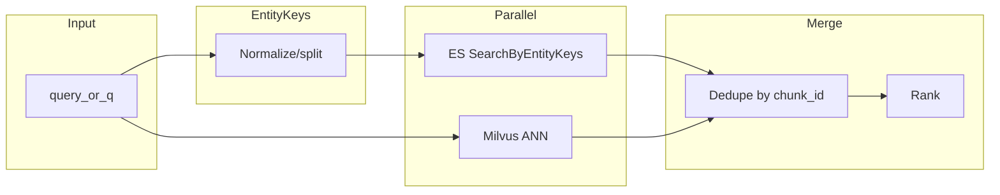

# 检索接口：ES 关键词召回 + Milvus 向量与去重（用户端与 Admin）

## 目标（相对 [design.md](../design.md) §5、§4.2）

- **用户端** `POST /v1/search`：在现有 Milvus 向量检索基础上，**并行**调用 ES 模块的 **实体关键词召回**（[`SearchByEntityKeys`](../internal/storage/es/repository.go)），将两路结果 **按 `chunk_id` 去重** 后返回统一 `hits`（与设计「混合召回」一致）。
- **Admin** `POST /v1/admin/query`：在保留现有 `search_type`（`file_name` / `chunk_id` / `text`）语义的前提下，增加 **检索后端模式**，支持：
  - **仅 Milvus**：与当前 `search_type=text` 行为一致（嵌入 + ANN）；
  - **仅 ES**：仅用 `q` 解析出的 `entity_keys` 调 ES，不调用嵌入；
  - **混合**：ES + Milvus 两路，**去重** 后输出（与用户端合并逻辑复用）。

## 现状摘要

- 公开搜索与 Admin `text` 模式均由 [`MilvusSearcher`](../internal/query/pipeline/searcher.go) 走 `queryByText` → 嵌入 → `SearchVectors`，**未接 ES**。
- ES 侧已有 [`SearchByEntityKeys`](../internal/storage/es/repository.go)，返回 [`EntityRecallHit`](../internal/storage/es/types.go)（含 `ChunkID`、`Score` 等，**无正文 snippet**）。
- [`NewHTTPServer`](../internal/app/http.go) 当前只注入 `Searcher` 与 `milvus.Repository`，**无 `es.Repository`**。

## API 与契约设计

### 用户端 `POST /v1/search`

- 新增可选字段（名称可二选一，实现时与前端对齐其一即可）：
  - **`retrieval`**：`"hybrid"`（默认）| `"milvus"` | `"es"`  
  - 默认 **`hybrid`**：满足「接 ES + 与 Milvus 去重」；`milvus` / `es` 便于调试与 A/B。
- **`SearchDebug.recall_counts`**：区分 `es`、`milvus`、`merged`（或 `after_dedupe`），便于观测（已有 map 结构可扩展 key）。

### Admin `POST /v1/admin/query`

在 [`AdminQueryRequest`](../internal/api/dto/admin_query.go) 增加：

- **`retrieval_mode`**（必填或默认 `hybrid`）：`es` | `milvus` | `hybrid`。
- 语义约定：
  - `search_type=text` 且 `q` 非空：`retrieval_mode` 控制 **文本检索** 使用 ES / Milvus / 二者；
  - `search_type` 为 `file_name` / `chunk_id`：可 **忽略** `retrieval_mode`（仍为 Milvus 直查），或在文档中写明「仅 text 生效」，避免歧义。

响应 [`AdminQueryRecord`](../internal/api/dto/admin_query.go) 可增加可选字段 **`recall_source`**：`es` | `milvus` | `both`（混合去重后若同 chunk 两路都有，可标 `both` 或统一标主来源），便于 Admin UI 区分来源。

## 流水线设计

1. **从 query 得到 ES 键列表**  
   - MVP：对 `q`/`query` 做空白分词（必要时简单中英分隔），每段 `es.NormalizeEntityKey`，过滤空串；去重得到 `keys`。  
   - 后续：替换为 [`internal/query/entity`](../internal/query/entity/doc.go) 抽取结果，与入库侧实体归一策略对齐（[design.md](../design.md) §7）。

2. **并行召回**（`hybrid`）  
   - `context` 带超时；任一路失败策略：**记录 debug + 另一路结果**（或用户端与 design §5.3 一致可再讨论是否部分失败降级）。

3. **去重与排序**  
   - **主键**：`chunk_id`。  
   - **合并规则（建议写进实现注释）**：  
     - **方案 A（推荐 MVP）**：以 Milvus 分数为主序；仅出现在 ES 的 chunk 按 ES `_score` 接在后方；同 `chunk_id` 保留较高 Milvus 分，若无则保留 ES 分。  
     - **方案 B**：RRF（倒数排名融合），需两路先各自截断 `top_k` 或略放大再融合。  
   - 截断：合并后取前 `top_k`（或 Admin `limit`）。

4. **字段填充**  
   - Milvus 命中：沿用现有 `SearchHit`（含 `Ts`、距离分等）。  
   - ES 独有命中：无向量分时 `Score` 用 ES 返回；`Snippet`/`Title` 若为空，可对 `chunk_id` **二次 Milvus QueryByChunkIDs** 补全（可选，有额外延迟）；MVP 可仅填 `chunk_id`/`doc_id`/`source_type`/`lang`。

5. **配置与降级**  
   - `configs/api.yaml` 中 `elasticsearch.enabled=false` 时：`hybrid` 自动退化为 **仅 Milvus**；`retrieval_mode=es` 返回明确错误（503/400）并日志。  
   - `keys` 为空时：ES 路跳过；`hybrid` 等价 Milvus。

## 模块化与代码复用（强制约束）

**原则**：用户端与 Admin、以及 `es` / `milvus` / `hybrid` 三种模式，**共用同一套检索内核**；HTTP 层只做参数解析与 DTO 映射，**禁止**在 `handler/search.go` 与 `handler/admin_query.go` 各写一套 ES/Milvus/合并逻辑。

### 分层

| 层 | 职责 | 禁止事项 |
|----|------|----------|
| **handler**（`internal/api/handler`） | 校验、组装 `pipeline.SearchInput`、写 JSON | 直接调 `es.Repository` / `milvus` 搜索 |
| **pipeline.Searcher**（如 [`MilvusSearcher`](../internal/query/pipeline/searcher.go)） | 区分公开检索 vs Admin 直查（`search_type`）；**文本检索**统一委托下层 | 复制粘贴 `merge`、重复 `Embed+Search` |
| **recall 子包**（建议 `internal/query/recall`） | 实体键提取、单路 ES 召回、单路 Milvus 召回、**合并去重与排序**、返回 `[]pipeline.SearchHit` + 统计 | 依赖 `net/http` 或具体 handler |

说明：若希望 import 路径更短，也可使用 `internal/query/pipeline/recall/` 子目录，但**物理上必须与 Searcher 解耦**为独立 `.go` 文件集合，便于单测。

### recall 子包建议 API（实现时按此形状落地）

- **`EntityKeysFromQuery(query string) []string`**（或挂在小 struct 上便于注入未来 `entity.Extractor`）：唯一入口，ES 与 hybrid 共用。
- **`RecallES(ctx, keys, topK, filters...) → ([]SearchHit, int, error)`**：内部调用 `es.Repository.SearchByEntityKeys`，负责 **`EntityRecallHit` → `pipeline.SearchHit`** 映射（映射函数单处维护）。
- **`RecallMilvusText(ctx, query, topK, ...) → ([]SearchHit, int, error)`**：内部 `Embed` + `SearchVectors`，与当前 `queryByText` 行为一致，**从 searcher 迁入或抽成共享函数后由 searcher 调用**。
- **`MergeDedupe(esHits, mvHits, topK, strategy) → ([]SearchHit, mergedCount)`**：纯函数或可配置策略 struct；**hybrid 与用户端、Admin 共用**。
- **`RunTextRetrieval(ctx, spec TextRetrievalSpec) → TextRetrievalResult`**：`spec` 含 `Mode`（es|milvus|hybrid）、`Query`、`TopK`、可选 filter；`Result` 含 `Hits`、`RecallCounts map[string]int`、`Errors`（部分失败时）；**Searcher 根据 `SearchInput.Retrieval` / Admin 的 `retrieval_mode` 只调用此入口**。

后续 **5 路 rewrite**：在 pipeline 层对每条子 query 循环或并发调用 `RunTextRetrieval`（或仅 `RecallES`/`RecallMilvus` + 外层多路合并），**不复制** recall 实现。

### 单测与可替换性

- `MergeDedupe`、键提取、空 keys 降级：**表驱动单测**，不启真实 ES/Milvus。
- ES/Milvus 召回可对 `recall` 包注入 **interface**（窄接口：`SearchByEntityKeys` / `VectorSearch`）便于 mock；若工期紧，至少保证合并与映射可单测。

## 工程落点

| 区域 | 改动要点 |
|------|----------|
| **`internal/query/recall/`**（新建） | `entity_keys.go`、`es.go`、`milvus_text.go`、`merge.go`、`orchestrator.go`（`RunTextRetrieval`） |
| [`internal/query/pipeline/types.go`](../internal/query/pipeline/types.go) | `SearchInput` 增加 `Retrieval` / `RetrievalMode`；`SearchDebug` 扩展 recall 统计 |
| [`internal/query/pipeline/searcher.go`](../internal/query/pipeline/searcher.go) | `searchPublicVector` 与 Admin `text` 分支调用 `recall.RunTextRetrieval`；直查 `file_name`/`chunk_id` 仍走现有 Milvus 路径 |
| [`internal/app/http.go`](../internal/app/http.go) | 构造 `recall` 依赖并注入 Searcher |
| [`internal/api/handler/search.go`](../internal/api/handler/search.go) | 仅解析 `retrieval` → `SearchInput` |
| [`internal/api/handler/admin_query.go`](../internal/api/handler/admin_query.go) | 仅解析 `retrieval_mode` → `SearchInput` |
| [`internal/api/dto/search.go`](../internal/api/dto/search.go)、`admin_query.go` | 字段与校验 |

## 与既有计划的衔接

- 若后续实现 **5 路 rewrite**，每路子查询均可 **各自** 走上述「ES + Milvus + 去重」或仅扩大 `keys` 与向量 query；本计划不阻塞 rewrite，合并函数应保持 **单 query 输入** 可复用。

## 验收要点

- Admin：`retrieval_mode=es|milvus|hybrid` 行为符合上表；`hybrid` 下无重复 `chunk_id`。  
- 用户端：默认混合；`X-Search-Debug: 1` 下可见 ES/Milvus 召回量与合并后数量。  
- ES 关闭时：混合不崩溃；仅 ES 模式错误可读。
